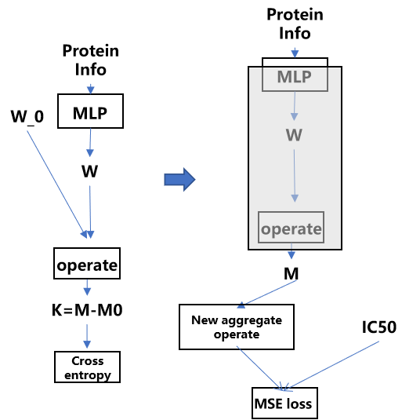
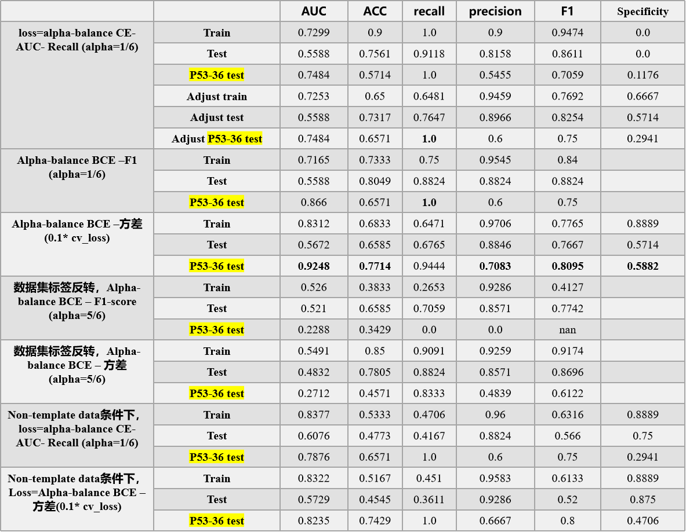
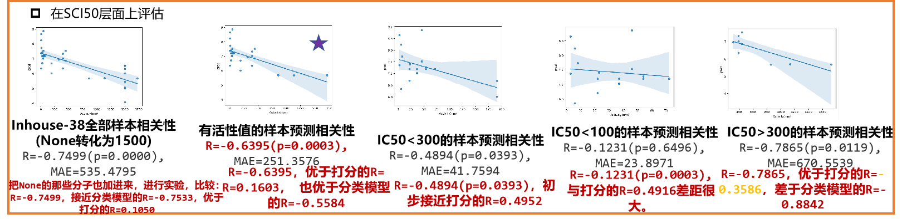
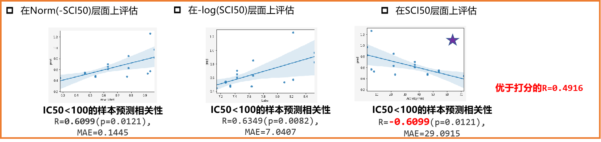

# AP-AlloClaModel
This project provides an implementation of the classify of **(allosteric) Active molecule** and **(allosteric) InActive molecule** based on the physical basis model's output.
      
## Model Architecture

## Key points   
Based on the model architecture shown above, we test different task definitions _(Classification & Regression)_, loss functions _(Alpha-balance BCE – F1
 & Alpha-balance BCE – 方差 & alpha-balance CE- AUC- Recal)_, and data processing strategies _(Basic docking & Template docking)_.    

1.  As can be seen from the following table, the classification model converges well on the data set, and shows good generalization ability in the independent test set P53-36 test.  

  

2. We compare the model with docking in many aspects, **good recall rate** and **excellent accuracy rate**, and the sample considered as 1 by the model has a high probability of being experimental active molecules; At the same time, even under the condition of unbalanced positive and negative samples (positive and negative ratio 5:1), it can pay attention to negative samples and has a good true negative.   
We further evaluated the scenario applicability of the model.   
3. In order to verify its scenario applicability and stability, huge evaluated work is further done. 

4.    Under the regression task definition, we obtained two good checkpoints, both of which achieved better performance than docking on the activity sequencing.     

**MBN_Regression_V1_2UM**  

   
   

**MBN_Regression_V1_100NM**   

## Project file organize  
This section briefly describes the project folders and files and will be updated soon after desensitization...  

## Usage
Then give a briefly describe of how to use it and will be updated soon after desensitization...